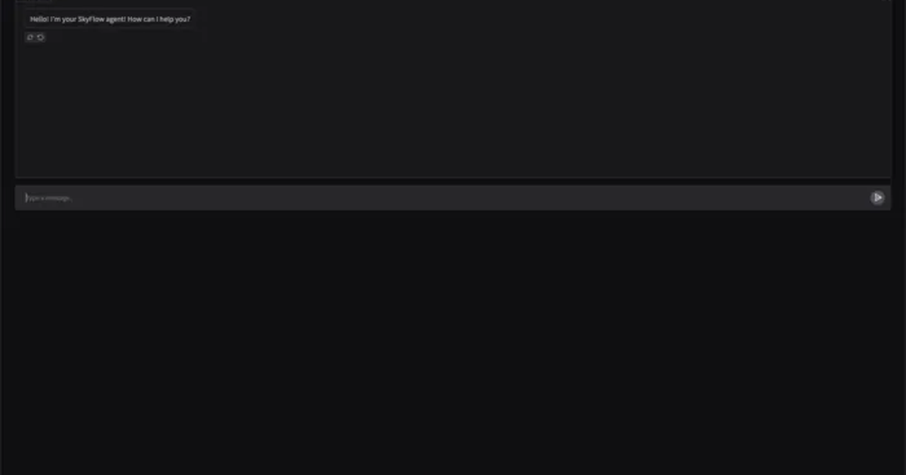

# Octavio-Daniel Vizaru — Portfolio

Professional portfolio website built with **React**, **TypeScript**, **Vite**, and **Tailwind CSS**.

[](https://www.octaviodanielvizaru.xyz)
[](https://react.dev/)
[](https://www.typescriptlang.org/)
[](https://vitejs.dev/)
[](https://tailwindcss.com/)



---

## Table of Contents

- [Overview](#overview)
- [Core Features](#core-features)
- [Architecture](#architecture)
- [Tech Stack](#tech-stack)
- [Getting Started](#getting-started)
- [Scripts](#scripts)
- [Content Management](#content-management)
- [Styling and UI System](#styling-and-ui-system)
- [Performance and Accessibility](#performance-and-accessibility)
- [SEO and Metadata](#seo-and-metadata)
- [Deployment](#deployment)
- [Project Structure](#project-structure)
- [Maintenance Checklist](#maintenance-checklist)
- [License](#license)

---

## Overview

This repository contains the source code for a modern, production-ready personal portfolio with a strong focus on:

- clear professional storytelling
- premium visual presentation
- smooth interaction design
- performance-oriented frontend architecture

The app is intentionally **content-driven**: most personal and section data is maintained in one place (`src/config/index.ts`), so updates can be made without touching component logic.

---

## Core Features

- Refined hero section with smooth staged intro animation
- Reduced-motion support for accessibility (`prefers-reduced-motion`)
- Responsive layouts for all major sections
- Dark/light theme toggle with persistent user preference
- Enhanced contact popover (email app + Gmail compose + copy email)
- Project showcase cards with visual emphasis
- Config-driven skills and certifications sections
- Cross-browser favicon support (including Safari/macOS)
- Built-in Vercel Analytics + Speed Insights

---

## Architecture

### 1. Data layer (config-driven)

`src/config/index.ts` exports:

- `SITE_CONFIG`: global metadata and navigation
- `SITE_CONTENT`: section content (hero, experience, projects, skills, certifications, about)

This keeps UI components reusable and presentation-focused.

### 2. Presentation layer (components)

`src/components/*` renders each section independently:

- `Hero`, `Experience`, `Projects`, `Skills`, `Certifications`, `About`
- shared UI parts like `Header`, `Footer`, `ThemeToggle`, `Section`

### 3. Layout and composition

- `src/layouts/Layout.tsx` handles global structure and section reveal behavior
- `src/App.tsx` composes page sections in final order

---

## Tech Stack

- **Framework:** React 19
- **Language:** TypeScript (strict mode)
- **Build tool:** Vite 8
- **Styling:** Tailwind CSS 4 + custom global CSS
- **Package manager:** pnpm 10
- **Analytics:** `@vercel/analytics`, `@vercel/speed-insights`

---

## Getting Started

### Prerequisites

- Node.js `20+`
- pnpm `10+`

### Install

```bash
pnpm install
```

### Run development server

```bash
pnpm dev
```

### Build production bundle

```bash
pnpm build
```

### Preview production bundle locally

```bash
pnpm preview
```

---

## Scripts

| Command | Purpose |
| --- | --- |
| `pnpm dev` | Start local Vite dev server |
| `pnpm build` | Type-check + create production build |
| `pnpm preview` | Serve built output from `dist/` |

---

## Content Management

Primary content file: **`src/config/index.ts`**

### `SITE_CONFIG`

Use this for:

- page title and description
- author and language
- logo path
- nav links
- social links
- social image

### `SITE_CONTENT`

Use this for:

- hero text and contact email
- work experience entries
- project data (summary, links, images)
- grouped skills
- certifications
- about section text/image

---

## Styling and UI System

- Tailwind utility classes are used for component styling
- Custom global rules and animation behavior are in `src/styles/global.css`
- Theme colors are CSS-variable based for clean dark/light switching
- Fonts are preloaded from `public/fonts` to reduce layout shifts

---

## Performance and Accessibility

### Performance choices

- optimized static image assets in `public/`
- smooth animations using `transform` + `opacity`
- staged reveal effects without heavy runtime dependencies
- static-site output via Vite for fast hosting

### Accessibility choices

- reduced motion fallback for animation-sensitive users
- semantic section structure
- visible focus styles
- descriptive labels for interactive elements

---

## SEO and Metadata

Configured in `index.html`:

- canonical URL
- Open Graph tags (`og:*`)
- Twitter card tags
- favicon declarations (SVG + PNG + Apple touch icon)
- author + description metadata

---

## Deployment

This is a static Vite app. Deploy the generated `dist/` directory to any static host.

### Recommended (Vercel / Netlify)

- **Install command:** `pnpm install`
- **Build command:** `pnpm build`
- **Output directory:** `dist`

### Domain and metadata checklist

Before going live:

- update canonical URL in `index.html`
- verify `og:image` path
- verify favicon and Apple icon paths
- confirm social/profile links in `src/config/index.ts`

---

## Project Structure

```text
src/
  components/   # Section and shared UI components
  config/       # Site metadata + portfolio content
  icons/        # Icon components
  layouts/      # Global page layout and observers
  styles/       # Global CSS, variables, animation rules
  types/        # Shared TypeScript types/interfaces
public/         # Static assets (images, fonts, CV, icons)
index.html      # Metadata, preloads, favicon links
vite.config.ts  # Vite + Tailwind + path aliases
```

---

## Maintenance Checklist

Use this quick list before major updates:

- keep `src/config/index.ts` content up to date
- optimize/replace large images before committing
- run `pnpm build` after changes
- verify dark/light theme behavior
- verify mobile layout and spacing
- verify metadata/favicons after deployment

---

## License

MIT — see [LICENSE](./LICENSE).
